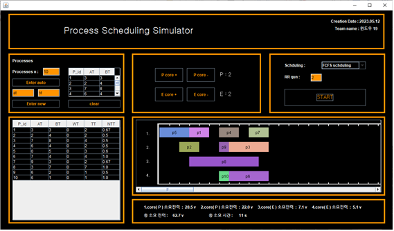
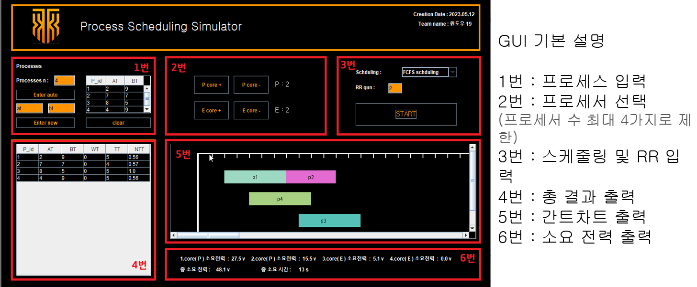

# 운영체제 프로세스 스케줄러 시뮬레이터

## 개요
- 운영체제 프로세스 스케줄러 시뮬레이션을 위한 프로젝트 입니다. Java, Java Swing을 이용해 구현하였습니다.
  

- 기능
  - 기본 스케줄러 5가지 + 우리들만의 스케줄러 1가지
  - 15개 이상 프로세스
  - 최대 4개의 프로세서
  - P코어, E 코어 설정
  - 코어 종류에 따른 전력 계산
  - GUI로 가시화 구현

## 실행 예시
- FCFS 예시  
  
  
- GUI 설명   
  
